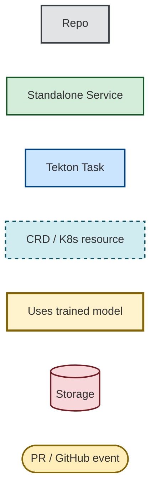
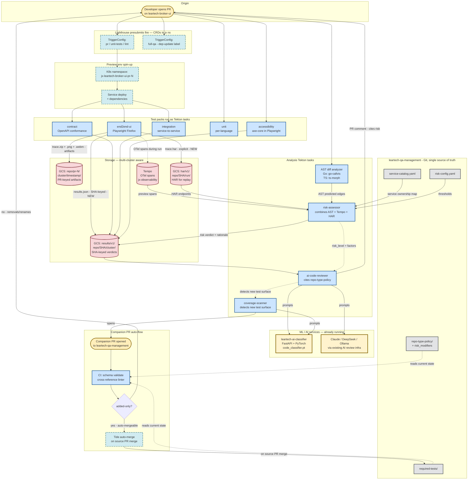
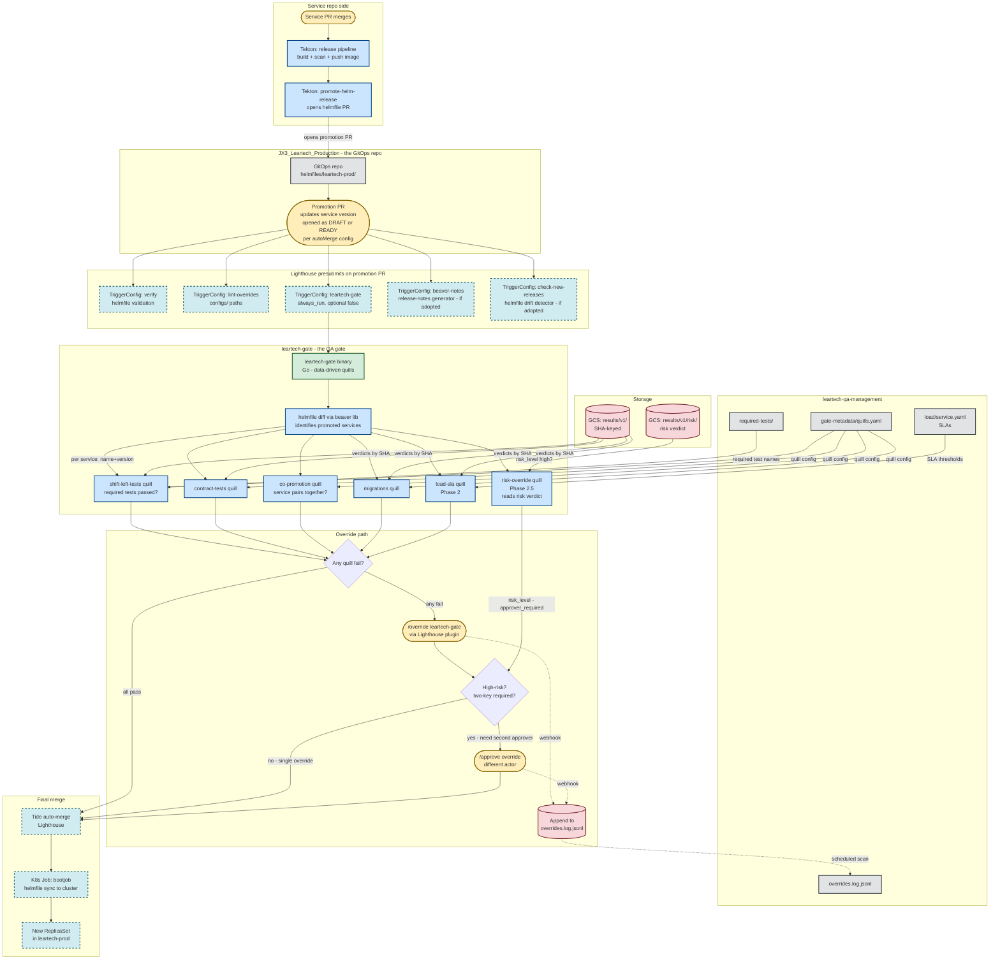
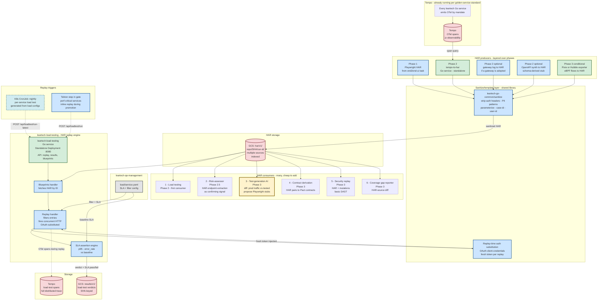
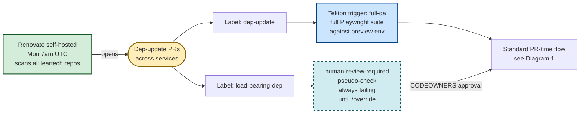

# Mermaid diagrams — QA architecture flows

Visual reference for the leartech QA architecture. Four diagrams covering PR-time flow, promotion + gate flow, HAR pipeline, and Renovate. Each rendered with consistent styling so component types are visually distinguishable.

## Legend

---

## Diagram 1 — PR-time flow on a service repo

The gate-keeping moment. Everything below fires when a developer opens a PR against, say, `leartech-broker-ui`.

### Notes on Diagram 1

- **`risk-assessor` is the hub** of the analysis subgraph — it combines AST (env-independent primary), Tempo spans, HAR endpoints, and the service-catalog into a risk verdict. The verdict drives both `ai-code-reviewer`'s PR comment and `coverage-scanner`'s companion-PR proposals.
- **Trained models** (yellow) appear three times in this flow — `ai-code-reviewer` calls Claude/DeepSeek for code commentary, `coverage-scanner` calls the leartech-ai-classifier for "what test should be added", and `risk-assessor` is currently rule-based but could call the classifier in v2.
- **The companion PR** is the structural fix for mqube's drift problem. It auto-merges only when the diff is `added-only`; removals/renames need human review.

---

## Diagram 2 — Promotion + gate flow (PR against GitOps repo)

What happens after the service merges. The gate sits here — `leartech-gate` is the porcupine-equivalent.

### Notes on Diagram 2

- **The gate itself is a Go binary** running inside a Tekton task — not a standalone deployment. It executes, exits, posts a check status. Not always-on.
- **Risk-driven override stiffening** — when `risk_level: high`, the gate reads `override_policy.two_key_required: true` and `/override leartech-gate` requires a second `/approve override` from a different actor. Mqube has flat overrides; ours scale with risk.
- **The audit log** is appended to via webhook (Lighthouse → small webhook receiver → PR or scheduled scan). Worth ironing out: how exactly does the webhook write find its way back to `gate-metadata/overrides.log.jsonl` without contention?

---

## Diagram 3 — HAR pipeline + load testing (multi-producer)

The strategic infrastructure. Multiple producers feed one engine; load testing is the first consumer but more come.

### Notes on Diagram 3

- **Producers are layered by phase** — Playwright (already free, Phase 1), Tempo→HAR (Phase 2, reuses existing observability), gateway-log + OpenAPI synth (Phase 2 optionals), Pixie/Hubble (Phase 3 conditional). Each addition is independent.
- **Sanitize/template is two phases** — storage-time redaction (strips auth/PII so HAR is safe to keep) + replay-time auth substitution (mints fresh OAuth tokens). Both phases reuse `leartech-go-common`.
- **The replay engine is a standalone Go service**, lifted from `mqube-load-testing`. Has its own HTTP API (port 8080) so triggers can come from CronJob curl, Tekton step, or manual ops calls.
- **Six consumers shown** — only #1 (load testing) is Phase 2; the rest are Phase 3 cheap additions because the HAR pipeline already exists. **#3 test-generation AI** is the one that closes the loop — Tempo shows production traffic, Playwright HARs show what's tested, the diff becomes a PR proposing new Playwright tests.

---

## Diagram 4 — Renovate hardening (cross-cutting)

Renovate is its own thread that touches all three flows above.

### Notes on Diagram 4

- **Renovate is already self-hosted on GCP** (per `~/leartech/hub/status/code-standards.md` line 21). What's new is the `full-qa` trigger and the load-bearing-dep policy.
- **Two parallel labels** — `dep-update` triggers the full-qa pack; `load-bearing-dep` blocks via `human-review-required`. Both can be true on a single PR.
- **CODEOWNERS sign-off** is the override path for load-bearing changes; not flat `/override` because the risk is high enough that we want named owners involved.

---

## Component-type summary

For asking follow-ups about deployment shape:

| Component | Type | Where it runs |
|---|---|---|
| `leartech-qa-management` | **Repo** | GitHub; consumed by everyone via Renovate-pinned tags |
| `leartech-gate` | **Go binary in Tekton task** | Runs as PipelineRun on every promotion PR; not always-on |
| `leartech-load-testing` | **Standalone Service** | Long-running Deployment in `leartech-loadtest` ns; HTTP API on :8080 |
| `tempo-to-har` | **Standalone Service** (Phase 2) | Long-running Deployment; queries Tempo on schedule, pushes HAR to GCS |
| `risk-assessor` | **Tekton task** (Phase 2.5) | Runs per-PR; combines AST output + Tempo + HAR; not a standalone svc |
| `coverage-scanner` | **Tekton task** (Phase 2) | Runs per-PR; reads service-catalog + diff; opens companion PR via GitHub API |
| `ai-code-reviewer` | **Tekton task** (already exists) | Calls existing leartech-ai-classifier + Claude/DeepSeek |
| Lighthouse `TriggerConfig` / `Plugins` | **CRDs** | In `jx` namespace; config-driven; control which presubmits fire |
| `K8s CronJob` (nightly load test) | **CRD** | One per service in `jx-staging` |
| Tekton `Task` / `PipelineRun` | **CRDs** | Ephemeral; created per run, garbage-collected |
| GCS buckets | **External storage** | `test-artifacts-product-first` (existing); paths added: `results/`, `har/` |
| Tempo + Loki + Prometheus | **External infra** | `jx-observability`; already running |
| Renovate | **Standalone service** | Already running on GCP, scans Mon 7am |
| `leartech-ai-classifier` | **Standalone Service** (already running) | jx-staging GCP; FastAPI + PyTorch model |

---

## Five things worth digging into

Anchor points for follow-up questions:

1. **The risk-override flow** — how exactly does the gate know to require two-key on high-risk PRs? It's via the `risk-override quill` (Diagram 2) which reads the risk verdict from GCS and modifies `override_policy.two_key_required` dynamically.

2. **Companion-PR auto-merge dependency** — how does Tide know to merge the qa-management companion PR only when the source service PR merges? Lighthouse supports cross-repo PR dependencies via labels (`depends-on:leartech-broker-ui#4521`), but the implementation detail is worth tightening.

3. **Producer-to-consumer fan-out for HAR** (Diagram 3) — the diff between #1 (load testing today) and #3 (test-generation tomorrow) is just a different consumer; nothing producer-side changes. Worth confirming the HAR storage path schema is consumer-agnostic.

4. **Trained-model usage** appears in three boxes (yellow). Worth deciding whether risk-assessor stays rule-based or learns from override patterns over time — Q22 in `open-questions.md`.

5. **Tempo as both source and sink** (Diagram 3) — load-testing both reads Tempo (via tempo-to-har) and writes Tempo (during replay). Could create a feedback loop if not careful — load-test traffic gets re-ingested as "real traffic" for next replay generation. Worth a guard.

---

## How to view these locally

GitHub renders Mermaid natively in `.md` files. So does most modern markdown previewers (VS Code, JetBrains, etc.). For ad-hoc rendering: paste a single diagram into <https://mermaid.live/> to iterate visually.

To export as PNG for slide decks: `mermaid-cli` (`npm install -g @mermaid-js/mermaid-cli`), then `mmdc -i diagrams.md -o out.png`.
